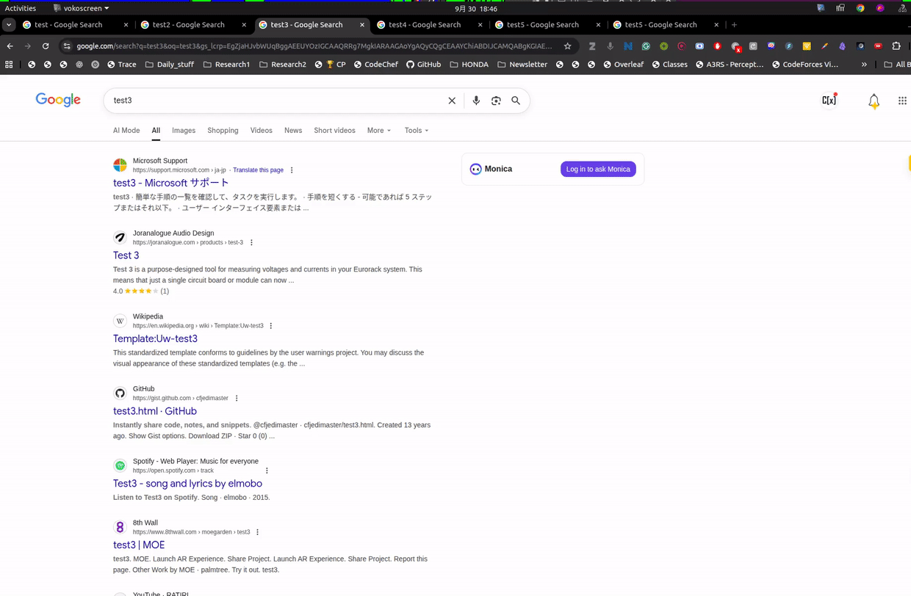
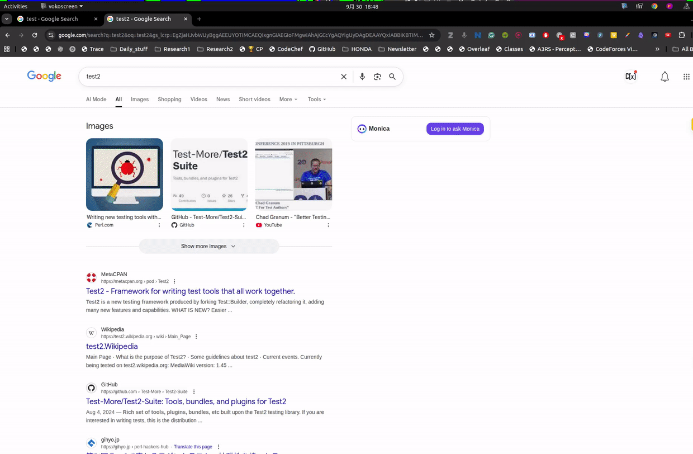

# rofi-chrome

rofi-chrome is a browser extension for better tab navigation without injecting javascript code on every tab you open.

This project is forked from [rofi-chrome](https://github.com/RKest/rofi-chrome) and modified to support manifest v3 and python3. Also since I like to have the tabs and history modes in normal rofi mode, I have the appropriate changes to the scripts.

## Features

### Switch between open tabs



### Open tab from history



## Installation

1) First, make sure you have [python3](https://www.python.org), [rofi](https://github.com/davatorium/rofi), and one of the [supported browsers](#supported-browsers) installed.

    Then, clone the git repo:

    ```sh
    git clone https://github.com/TheShiningVampire/rofi-chrome.git
    ```

2) Install native extension using the provided script:

    ```
    cd rofi-chrome
    ./scripts/install.sh
    ```

3) Load the unpacked extension located at `rofi-chrome/extension` to the browser of your liking.

    For example, if you are using chrome or chromium:

    * Go to `chrome://extensions/` in the browser and check the box for Developer mode in the top right.
    * Click the Load unpacked extension button and select the `rofi-chrome/extension` folder to install it.

    Configure the shortcuts for the various commands (`chrome://extensions/shortcuts` for chrome)

    For your reference, I use:

    - `ctrl+shift+r` for `Unified Rofi Picker for Chrome`

    Note: Make the shortcut global if you want to use it when the browser is not focused.

4) Make the main.py script executable:

    ```sh
    chmod +x host/main.py
    ```

5) Add scripts to make the `tab` and `history` commands available in rofi.

    Move the `rofi_scripts/rofi-chrome-tabs` and `rofi_scripts/rofi-chrome-history` to your local binary folder (e.g. `~/.local/bin`):

    ```sh
    cp rofi_scripts/rofi-chrome-tabs ~/.local/bin/
    cp rofi_scripts/rofi-chrome-history ~/.local/bin/
    ```

    Make these scripts executable:

    ```sh
    chmod +x ~/.local/bin/rofi-chrome-tabs
    chmod +x ~/.local/bin/rofi-chrome-history
    ```

6) Add the scripts to your rofi configuration file (e.g. `~/.config/rofi/config.rasi`):

    ```rasi
    configuration {
    modi: "window,drun,run,tabs:~/.local/bin/rofi-chrome-tabs,history:~/.local/bin/rofi-chrome-history,combi";
    combi-modi: "window,tabs,drun,history";
    }
    ``` 

Now, you have the extension working. Yay!

## Supported platforms

- Linux

## Supported browsers

- google chrome
